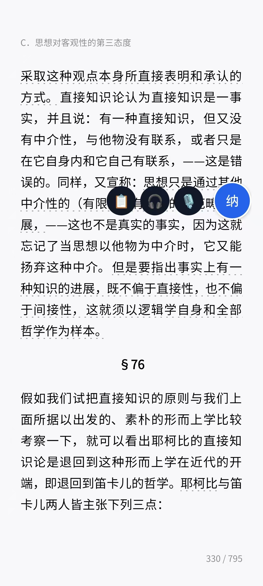
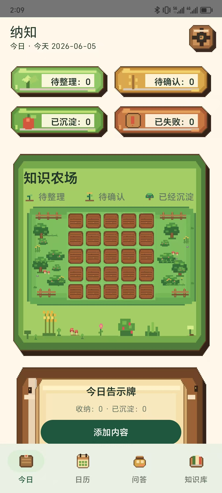
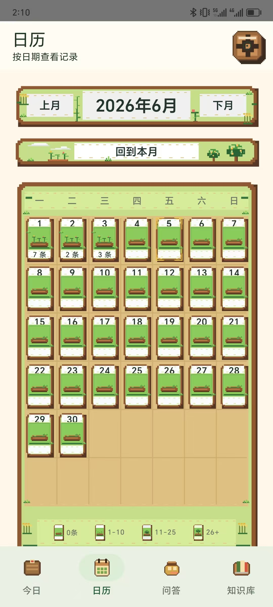
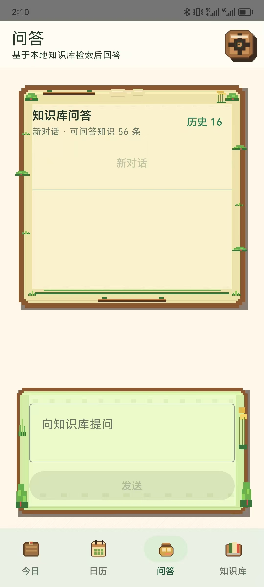
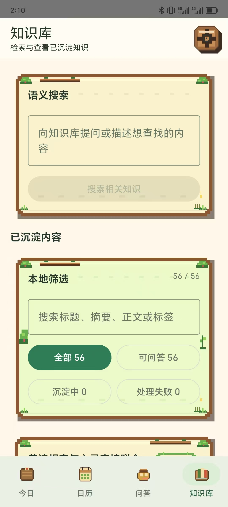

# 纳知 Nazhi Android

把手机里转瞬即逝的好内容，养成一座可以追问的知识农场。

纳知是一个本地优先的 Android 个人知识库。它用悬浮窗在微信阅读、短视频、网页、聊天和任意 App 中快速收纳内容，再用 AI 整理、语义检索和 RAG 问答，把碎片信息沉淀成真正可复用的知识。

## 为什么做纳知

每天刷到、读到、听到的信息很多，但真正能留下来的很少。收藏夹会堆灰，截图很难搜索，手动整理又太慢。

纳知想解决的是这条链路：

```text
看到 / 听到有价值的内容
        ↓
悬浮窗一键收纳文字或音频
        ↓
今日页统一整理
        ↓
沉淀到本地知识库
        ↓
需要时直接向知识库提问
```

## 产品预览

### 跨 App 收纳

不用切回纳知。阅读、刷视频、看资料时，悬浮窗就停在当前 App 上方，随手把内容收入今日。

| 阅读文字时粘贴保存 | 短视频中录制/转写音频 |
| --- | --- |
|  |  |

### 四个核心页面

| 今日 | 日历 | 问答 | 知识库 |
| --- | --- | --- | --- |
|  |  |  |  |

## 核心能力

### 1. 悬浮窗收纳

- 复制文字后用悬浮窗一键保存，适合阅读、网页、聊天和文档场景。
- 在短视频、课程、播客等场景中发起音频录制或系统音频捕获。
- 支持系统分享、Direct Share、文本选择菜单和剪贴板捕获。
- 上传或转写失败的音频会暂存，可在今日页统一重试。

### 2. 今日知识农场

- 今日页按状态展示 `待整理 / 待确认 / 已沉淀 / 已失败`。
- 碎片内容先进入今日收件箱，再由 AI 整理为结构化知识草稿。
- 像素农场用地块和作物表达每日知识状态，让整理过程有明确反馈。

### 3. 日历回顾

- 按日期查看历史收纳记录。
- 日期格按收纳数量显示不同生长状态。
- 适合回看某一天的阅读、视频、灵感和整理结果。

### 4. 本地知识库

- AI 草稿需用户确认后才正式入库。
- 支持标题、摘要、正文、标签的本地筛选。
- 支持索引状态追踪：可问答、沉淀中、处理失败。
- 知识条目、向量和对话记录优先保存在本地。

### 5. 知识库问答

- 提问时先从本地知识库做语义检索。
- 检索结果作为上下文发送给大模型，生成可追溯回答。
- 保留历史对话，支持引用来源回看。

## 设计方向

V1.4 采用“像素知识农场”视觉语言：界面有农场的温度，但正文、按钮、长回答和表单仍保持现代 Android 的可读性。

- PNG 资产负责像素边框、农田、作物、气泡和面板氛围。
- Compose / Material3 负责文字、滚动、输入、按钮、状态和交互。
- 不把文字写死进图片，所有文案仍可动态变化。

详细资产规则见 [docs/V1.4 UI资产规则.md](docs/V1.4%20UI资产规则.md)。

### 8. V1.4 像素知识农场 UI 改版

V1.4 聚焦视觉体验升级，引入像素农场主题，不改变数据库、后端接口、AI 整理逻辑、embedding、问答主逻辑、登录、同步或任务系统。

#### 核心视觉更新

- **今日页**：像素风状态标签、告示牌背景、知识农场面板、底部导航图标
- **日历页**：农场年鉴风格，草绿色面板、木质边框、叶片浆果点缀
- **问答页**：像素风消息气泡、输入面板、引用条背景
- **知识库页**：语义搜索面板、筛选面板、条目卡、空状态、状态徽标背景

#### 农场交互

- **5x5 农田网格**：每个地块可种植不同作物，代表知识条目
- **作物生长阶段**：幼苗 → 成长 → 成熟，对应知识条目状态
- **缩放拖拽**：支持 1.0x - 2.2x 缩放，放大后可拖拽平移
- **地块点击**：选中态覆盖层，聚合展示关联的 Note / Draft / KnowledgeEntry

#### 资产规范

- 所有 PNG 资产位于 `app/src/main/res/drawable-nodpi/`
- 不在 PNG 中内嵌中文、数字、状态文案、按钮文字、徽标或水印
- 所有可变文字由 Compose 覆盖渲染
- 像素边缘保持清晰，不做模糊、柔光、写实质感
- 详细资产规则见 `docs/V1.4 UI资产规则.md`

#### 技术实现

- **Canvas 渲染**：农场区域使用 `FilterQuality.None` 保持像素清晰
- **九宫格拉伸**：面板背景使用 NinePatch 避免边角变形
- **组件复用**：`NazhiStatusChip`、`FarmNoticeCard`、`DailyFarmPreview` 等
- **主题 token**：复用 `NazhiTokens` 和状态 palette，不散写一次性颜色

## 技术架构

### 技术栈

- 语言：Kotlin
- UI 框架：Jetpack Compose
- 数据库：Room（含 TypeConverters）
- 偏好存储：DataStore + EncryptedSharedPreferences
- 异步：Kotlin Coroutines
- 依赖注入：手写 `AppContainer`（V1 暂不引入 Hilt）

### 构建环境

- AGP 9.1.0
- Gradle 9.3.1
- JDK 17
- Android SDK API 36
- V1.4 UI 资产位于 `app/src/main/res/drawable-nodpi/`

### 数据模型

| 模型 | 说明 |
| --- | --- |
| `Note` | 原始笔记，按日期分组 |
| `KnowledgeEntryDraft` | AI 整理后的待确认草稿 |
| `KnowledgeEntry` | 用户确认入库的知识条目 |
| `EmbeddingRecord` | 知识条目的向量嵌入记录 |
| `ChatSession` / `ChatMessage` | 对话会话与消息 |
| `ChatCitation` | 回答中的引用来源 |
| `FarmPlot` | 农场地块状态（V1.4 新增） |
| `CropType` | 作物类型与生长阶段（V1.4 新增） |

### 模块结构

```text
app/src/main/java/com/nazhi/app/
├── core/
│   ├── audio/            # WAV 录音与音频转写基础能力
│   ├── capture/          # 捕获服务（悬浮窗、剪贴板）
│   ├── database/         # Room 数据库、DAO、Entity
│   ├── embedding/        # 本地向量嵌入
│   ├── export/           # 数据导入导出
│   ├── knowledge/        # 知识整理与索引协调
│   ├── model/            # 数据模型
│   ├── network/          # 后端 API 客户端
│   ├── repository/       # 数据仓库层
│   ├── settings/         # 设置存储
│   └── ui/               # V1.4 UI 组件与主题
│       ├── NazhiComponents.kt  # 像素风 UI 组件
│       └── NazhiTheme.kt       # 主题配置与 token
├── feature/
│   ├── calendar/         # 日历视图
│   ├── chat/             # RAG 问答
│   ├── farm/             # 知识农场
│   ├── home/             # 主页导航
│   ├── inbox/            # 今日收件箱
│   ├── knowledge/        # 知识库管理
│   └── settings/         # 设置页面
├── ClipboardCaptureActivity.kt
├── AudioTranscriptionActivity.kt
├── AudioTranscriptionPermissionActivity.kt
├── AudioTranscriptionService.kt
├── FloatingCaptureService.kt
├── MainActivity.kt
├── NazhiApp.kt
├── ProcessTextCaptureActivity.kt
├── ShareCaptureActivity.kt
└── SystemAudioCapturePermissionActivity.kt
```

## 快速开始

### 环境要求

- Android Studio（推荐最新稳定版）
- JDK 17
- Android SDK API 36

### 打开项目

使用 Android Studio 打开项目目录：

```text
nazhi-android
```

首次打开后执行 Gradle Sync。

### 构建验证

```bash
./gradlew :app:compileDebugKotlin
./gradlew :app:assembleDebug
```

Debug APK 输出位置：

```text
app/build/outputs/apk/debug/app-debug.apk
```

## 本地优先

纳知遵循 Local-First 原则：

- 笔记、知识条目、向量数据和对话记录优先存储在 Android 本地。
- 模型调用可走纳知后端代理，也可使用用户自配 API 服务。
- 支持离线浏览已保存内容。
- 用户可以导出、导入本地知识数据，导入后重建向量索引。

## 音频能力边界

- 系统音频捕获需要 Android MediaProjection 授权，且只能捕获第三方 App 允许被捕获的音频。
- 麦克风录音作为备用路径，适合外放、会议和环境声音；耳机场景可能录不到外部应用声音。
- 若第三方 App 禁止捕获或录制结果为空，纳知会提示失败并避免保存空 Note。
- 有效音频在上传或转写失败时会暂存；关联 Note 入库或删除后会清理原始音频。

## 项目状态

当前分支已完成 V1.4 UI 改版：今日、日历、问答、知识库主界面已统一为像素农场风格。后续重点建议放在真实使用反馈、稳定性和模型调用体验。

## 许可证

Private
